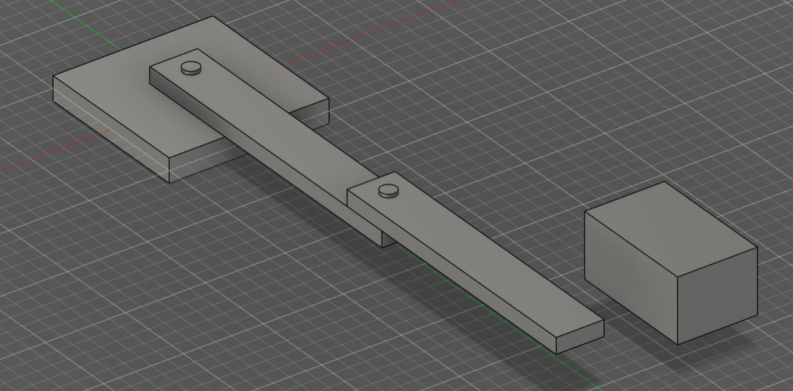
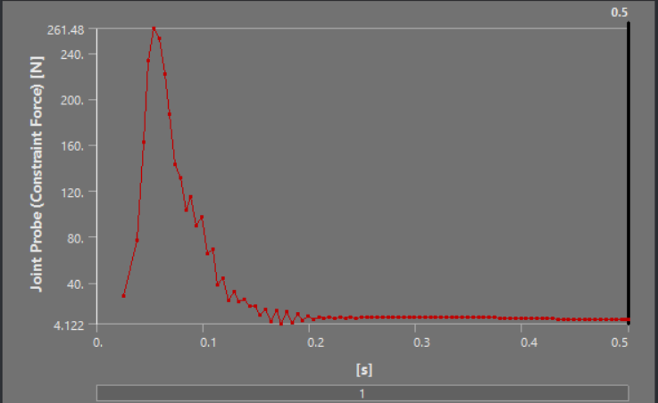
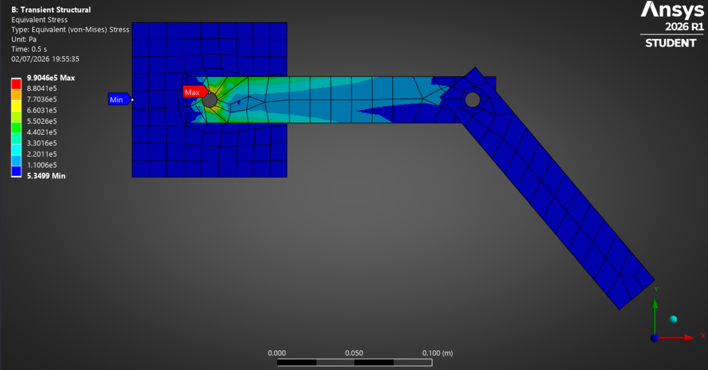
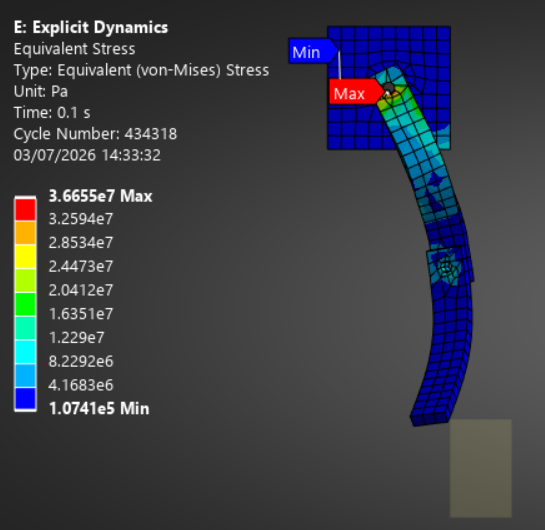
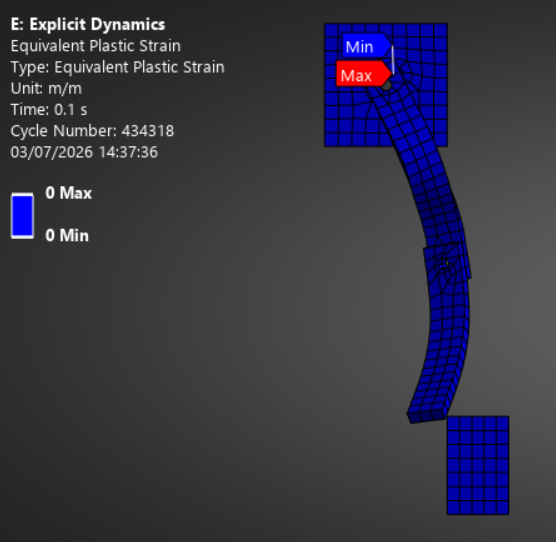
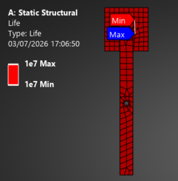
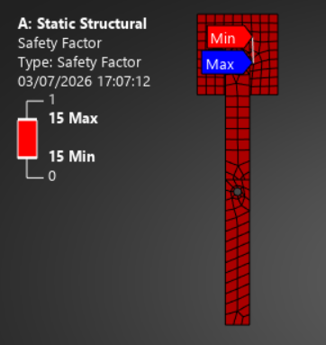
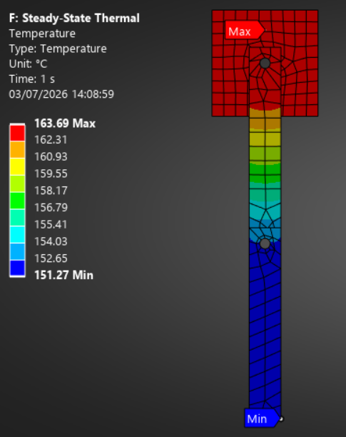
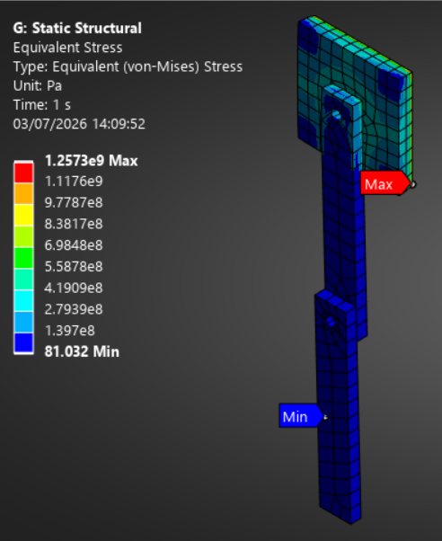
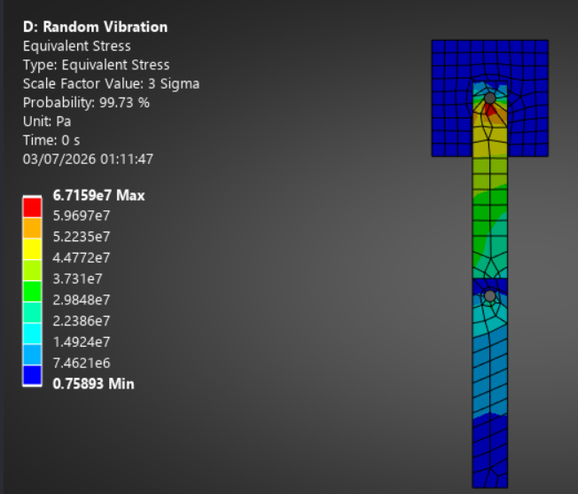

# Multiphysics Finite Element Assessment of a Two-Link Robotic Arm

## Abstract

This project presents a comprehensive **multiphysics finite element investigation** of a two-link robotic arm using **ANSYS Workbench Mechanical**.

The objective of this study is to evaluate the structural integrity and dynamic performance of the robotic arm under realistic operating conditions through five different simulation environments:

- Transient Structural Analysis
- Explicit Dynamics Impact Analysis
- Fatigue Analysis
- Steady-State Thermal Analysis
- Random Vibration Analysis

The results are used to identify potential failure modes and validate the design against dynamic, thermal, and cyclic loading conditions.

---

# Model Description

The robotic arm consists of two links connected through revolute joints with a fixed base constraint.

The CAD model developed in previous iterations was imported into ANSYS Workbench, where different multiphysics analyses were performed on the same baseline geometry.

## Simulation Setup

| Parameter | Value |
|---|---|
| Software | ANSYS Workbench Mechanical |
| Analysis Type | Multiphysics FEA |
| Joint Representation | Revolute Joints |
| Gravity | 9.81 m/s² |
| Motor Heat Generation | 40 W × 2 |

---

# Methodology

The robotic arm was evaluated under five different loading environments to assess structural performance across various operating scenarios.

The analyses included:

1. Dynamic motion response during operation
2. High-speed impact loading
3. Long-term cyclic fatigue behavior
4. Thermal effects due to motor heating
5. Structural response under vibration excitation

---

# 1. Transient Structural Analysis

## Objective

Simulate the robotic arm sweeping from **0° to 90° within 0.5 seconds** under gravitational loading and evaluate dynamic stresses and joint reaction forces.

## Boundary Conditions

- Fixed support at base
- Revolute joints at link connections
- Earth gravity applied
- Prescribed angular motion

## Results

### Observation

Dynamic loading resulted in increased stress compared to the static analysis due to inertial effects during acceleration and deceleration.

**Verdict: PASS**

---

# 2. Explicit Dynamics — Impact Analysis

## Objective

Evaluate the impact response of the end-effector when striking a rigid stop at a velocity of **1.5 m/s**.

## Boundary Conditions

- Fixed base constraint
- Second joint locked
- Rigid impact wall
- Initial velocity corresponding to 1.5 m/s end-effector speed

## Results

## Key Results

| Parameter | Value |
|---|---|
| Peak Impact Stress | 36.7 MPa |
| Permanent Deformation | None |
| Plastic Strain | 0 |

### Observation

The impact response remained completely elastic with no permanent deformation.

**Verdict: PASS**

---

# 3. Fatigue Analysis

## Objective

Estimate fatigue life of the joint shaft under cyclic torque loading using the Goodman correction method.

## Loading Condition

- Alternating torque: ±30 N·m
- Frequency: 1 Hz
- Goodman mean stress correction applied

## Results

                     

## Key Results

| Parameter | Value |
|---|---|
| Predicted Life | 10⁷ cycles |
| Design Requirement | 10⁷ cycles |
| Factor of Safety | >1 |

### Observation

The shaft satisfies the required fatigue life for long-term cyclic operation.

**Verdict: PASS**

---

# 4. Steady-State Thermal Analysis

## Objective

Evaluate temperature distribution and thermal stresses generated due to motor heat dissipation.

## Loading Condition

- Two motors
- Heat generation: 40 W each
- Ambient temperature: 22°C
- Natural convection

## Results

## Key Results

| Parameter | Value |
|---|---|
| Maximum Temperature | 163°C |
| Thermal Deformation | ~0.5 mm |
| Maximum Local Stress | 1.25 GPa |

### Observation

The peak thermal stress occurred near constrained corners due to stress concentration and idealized boundary conditions.

The localized stress is considered a numerical singularity rather than a global structural failure indicator.

**Verdict: PASS**

---

# 5. Random Vibration Analysis

## Objective

Evaluate structural response under random base excitation and determine vibration-induced stresses.

## Loading Condition

- PSD magnitude: 0.01 g²/Hz
- Frequency range: 20–500 Hz

## Results

## Key Results

| Parameter | Value |
|---|---|
| Maximum 3σ Stress | 67 MPa |
| Material Yield Strength | 250 MPa |

### Observation

The vibration-induced stress remains below the material yield strength.

**Verdict: PASS**

---

# Final Design Assessment

| Analysis | Critical Result | Verdict |
|---|---|---|
| Transient Structural | Dynamic Stress | PASS |
| Explicit Dynamics | No Plastic Deformation | PASS |
| Fatigue | 10⁷ Cycle Life | PASS |
| Thermal | Acceptable Deformation | PASS |
| Random Vibration | 67 MPa < 250 MPa | PASS |

---

# Discussion

The Multiphysics assessment demonstrates that the robotic arm design maintains structural integrity under the investigated operating conditions.

The highest stress concentrations were observed near constrained regions, particularly during thermal loading. These regions are primarily influenced by boundary condition effects and geometric discontinuities.

## Future Improvements

- Mesh convergence study
- Geometry optimisation near joint interfaces
- Experimental validation
- Topology optimisation
- More realistic motor and bearing modelling

---

# Tools Used

- ANSYS Workbench Mechanical
- Transient Structural Analysis
- Explicit Dynamics
- Fatigue Tool
- Steady-State Thermal Analysis
- Random Vibration Analysis
- CAD Modelling

---

# Files Included

- **ANSYS/** — Complete ANSYS Workbench project file
- **CAD/** — Original CAD geometry used for simulation
- **Results/** — Simulation result screenshots and contours
- **Report/** — Detailed FEA report containing methodology and conclusions

---

